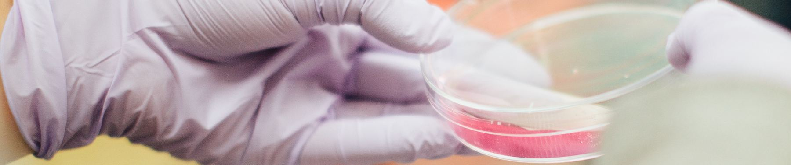

# PyTorch Image Classification

This project uses PyTorch framework<br>
and AWS SageMaker to train an image classifier<br>
to classify blood cell images.<br><br>

The classification is based on ResNet-50 neural network that we fine-tune here for the target dataset<br>
while utilizing SageMaker profiling, debugger, and hyperparameter tuning.<br>
<br><br>

This project was part of my Machine Learning Nanodegree at Udacity<br>
The dataset I chosen come from [kaggle/paultimothymooney/blood-cells](https://www.kaggle.com/datasets/paultimothymooney/blood-cells)<br>
and contains 4 classes of blood-cells: Eosinophils, Lymphocytes, Monocytes, and Neutrophils.<br><br>



The model is then deployed to a Sagemaker Endpoint for inference.

## Project Set Up Instructions
The jupyter notebook and is prepared to be run on AWS SageMaker Notebook Instance<br>
where it orchestrates the whole process from the data preparation, 
hyperparameter tuning and training, to the deployment<br>

## Files
The project contains the following files:
- `train_and_deploy.ipynb` - the main jupyter notebook
- `hpo.py` - pytorch code for hyperparameters tuning
- `train_model.py` - pytorch code for model training

## Selected model
This project uses ResNet-50 for transfer learning against our dataset.<br>
The RestNet-50 is a convolutional neural network that is 50 layers deep,<br>
expects as input images of 224 x 224 pixels<br>
and is relatively compact taking just 98 MB.

## Querying a model endpoint
You can find the example in the notebook around the function predict 
```
# Deploy the model to an endpoint
predictor=estimator.deploy(initial_instance_count=1, instance_type='ml.m5.large')

# The predict function takes as input an image_url, preprocesses it, and uses the endpoint for the prediction
def predict(image_path):
    image = Image.open(image_path)

    transform = transforms.Compose([
            transforms.Resize((224, 224)),
            transforms.ToTensor(),
        ])

    preprocessed_image = transform(image).unsqueeze(0)
    preprocessed_image = preprocessed_image.to("cpu")

    response = predictor.predict(preprocessed_image)
    pred = np.argmax(response, 1)+1
```